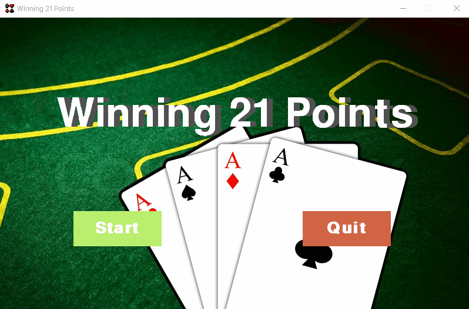

# Winning21Points

一个通过 `pygame` 实现的 `21点` 游戏

## 效果




## 运行


### `winning21Points_shell.py` 终端命令行

```bash
python winning21Points_shell.py
```

### `winning21Points_gui.py` 图形化界面

```bash
python winning21Points_gui.py
```

### No module named `pygame`

```bash
python3 winning21Points_gui.py 
Traceback (most recent call last):
  File "winning21Points_gui.py", line 4, in <module>
    import pygame
ModuleNotFoundError: No module named 'pygame'
```

#### 解决方法

```bash
pip3 install pygame
```

